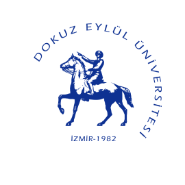
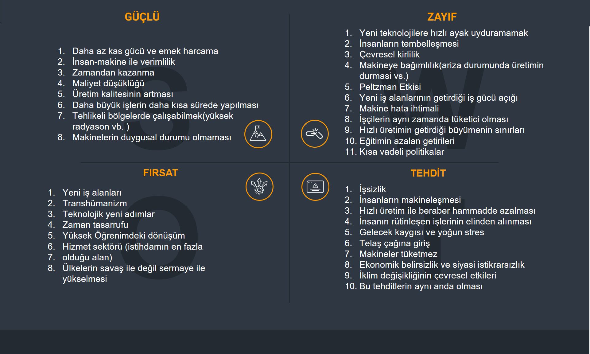
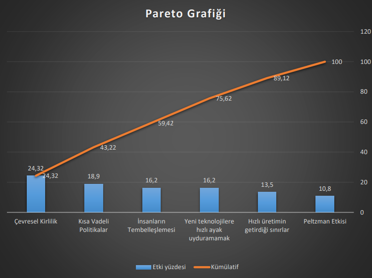
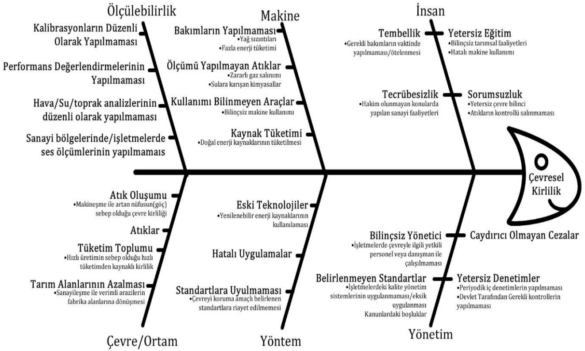
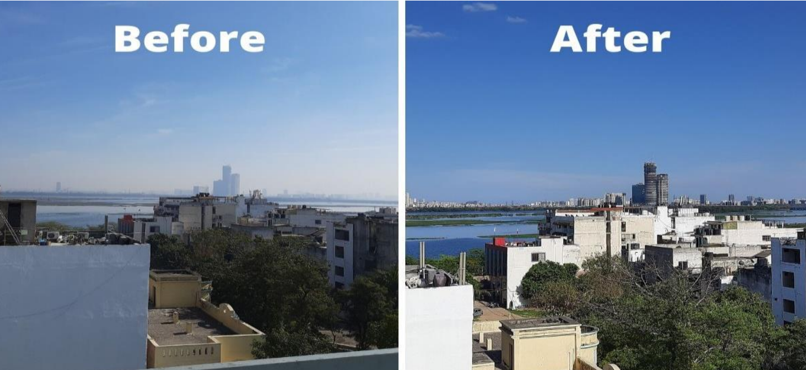
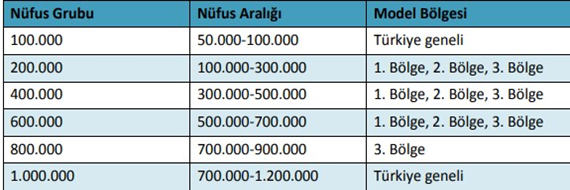
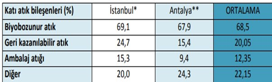
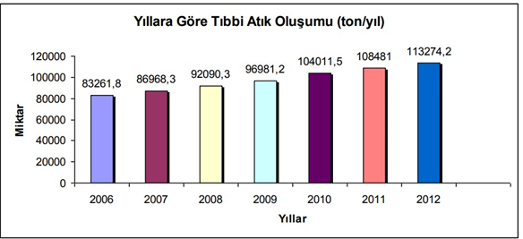

**TELETABİLER**

**Konu:** Makineleşmenin İnsanlığa Etkisi 

Yiğit Çakmak (Takım Lideri) 

Evren Çıkrıkçıoğlu 

Furkan Çakmak 

# Makineleşmenin İnsanlığa Etkisi

## İçindekiler

- [Konu](#Konu)
- [Kayıp Türü](#Kayıp-Türü)
- [İyileştirilecek Konuyu Seçme Nedeni](#İyileştirilecek-Konuyu-Seçme-Nedeni)
- [Hedefin Belirlenmesi](#Hedefin-Belirlenmesi)
- [Faaliyet Planı](#Faaliyet-Planı)
- [Problemin Açıklanması](#Problemin-Açıklanması)
  * [SWOT Analizi](#SWOT-Analizi)
- [Zayıf Noktalardan Pareto Analizi](#Zayıf-Noktalardan-Pareto-Analizi)
  * [Pareto Değerlendirmesi](#Pareto-Değerlendirmesi)
  * [Pareto Değerlenirmesi Yüzdelik Değerleri ve Kümülatifi](#Pareto-Değerlenirmesi-Yüzdelik-Değerleri-ve-Kümülatifi)
- [Risk Derecelendirmesi](#Risk-Derecelendirmesi)
  * [Risk Derecelendirme Matrisi Tanımı](#Risk-Derecelendirme-Matrisi-Tanımı)
  * [Risk Derecelendirme Matrisi](#Risk-Derecelendirme-Matrisi)
- [Pareto Grafiği](#Pareto-Grafiği)
- [Balık Kılçığı](#Balık-Kılçığı)
- [Aksiyon Planı](#Aksiyon-Planı)
- [Problem Çözümünün Anlatılması](#Problem-Çözümünün-Anlatılması)
- [İzleme](#İzleme)
- [Hedef ve Karşılaştırma](#Hedef-ve-Karşılaştırma)
  * [Çevresel Kirlilik](#Çevresel-Kirlilik)
  * [Hava Kirliliği](#Hava-Kirliliği)
  * [Duman Kirliliği](#Duman-Kirliliği)
  * [Kimyasal Kirlilik](#Kimyasal-Kirlilik)
  * [Su Kirliliği](#Su-Kirliliği)
  * [Kirliliği Önlemek](#Kirliliği-Önlemek)
  * [Bölgelerin Yıllık Ortalama Atık Oluşumu](#Bölgelerin-Yıllık-Ortalama-Atık-Oluşumu)
  * [Yıllara Göre Tıbbi Atık Oluşumu](#Yıllara-Göre-Tıbbi-Atık-Oluşumu)
- [Standartlaştırma](#Standartlaştırma)
- [Yaygınlaştırma](#Yaygınlaştırma)
- [Atıfta Bulunulacak Takımlar](#Atıfta-Bulunulacak-Takımlar)

## Konu

**Makineleşmenin İnsanlığa Etkisindeki** Makinelerin yapılış amacını iyi değerlendirilip iyi analiz edilmelidir. 

Genel amaçlar şunlardır: 

•    İşin zamanını kısaltıp verimliliği arttırmak 

•    Daha az kas gücü ve emek harcama 

•    Tehlikeli bölgelerde çalışabilmeye imkan sağlamak. 

Aşağıdaki konular ele alınacaktır: 

•    Makineleşme ve yeni teknolojilerin insanlara daha çok yeni istihdam alanı mı yoksa daha çok işsizlik mi yarattığı tespit edilecek. 

•    İnsanların telaş çağına girmesi makinelerle bağlantılı olup olmadığı araştırılacak. 

•    Çevresel Kirliliğin makineleşmeyle mi birlikte geldiği araştırılıp yeni teknolojilerin çevresel kirliliği düzeltmekte ne kadar rol oynayabileceğini ölçme. 

•    Ne kadarlık bir insan kitlesinin Peltzman etkisinden etkilendiği 

•    Makineleşmenin getirdiği iş gücü açığının hangi eğitim düzeyindeki insanları etkilediği araştırılacak. 

•    Makineleşmenin kültürel farklılık ve örf adetlere nasıl etki ettiğini ölçülecek. 

## Kayıp Türü

•    İletişim eksikliği ve bozukluğu 

•    Tembellik ve Makine bağımlılığı 

•    Çevre Kirliliği 

•    Örf adet ve değerler 

•    Ekonomik belirsizlik ve siyasi istikrarsızlık 

•    Gelecek kaygısı ve yoğun stres 

•    Telaş çağının getirdiği olumsuzluklar 

•    İstihdam

•    Hızlı değişen politika ve siyaset 

•    Hammadde

## İyileştirilecek Konuyu Seçme Nedeni 

•    Makinelerin insanlar üzerinde etkilerini belirleyip bunlar üzerindeki olumsuz etkileri azaltacak önlemleri başlatmak ve belirlemek. 

•    Çevresel kirliliğin makinelerin ne oranda sebep olduğunu belirlemek ve çevresel kirliliğin önüne geçebilecek tedbirleri belirlemek. 

•    Gelecekte insanların yerine geçen makinelerin ortaya çıkaracağı işsizlik konusunda insanları yeni mesleklere yönlendirilmesini başlatmak. 

•    Makinelerin yeni teknolojilere geçişleri ve bunlara ayak uydurabilmesi için yapılması gerekenleri saptamak. 

•    Makineler sayesinde nasıl en az kas gücünden yararlanılması ve verimliliğin arttırılması çalışmasına başlamak. 

## Hedefin Belirlenmesi

•    Çevresel kirliliğin önüne geçecek tedbirlerin alınması, ekolojik sistemlerin uygulanması. 

•    Makinelerin insanların yerine geçmesinden dolayı açığa çıkan iş gücü açığını yeni meslek ve sektörlere yönlendirmek. 

•    Makinelerin yeni teknolojilere geçiş ve entegrasyonunu sağlamak. 

•    İnsanların makinelerden tembelleşmelerinin önüne geçebilmek için spor, tiyatro, sanat ve çeşitli hobilere yönlendirmek. 

•    Gerekli kısa vadeli politikaları belirlemek 

•    En verimli şekilde makinelerin kullanımını artırmak. 

## Faaliyet Planı 

| **Planlanan İş**                    | **Sorumlu**        | **Tarih**      |
| ----------------------------------- | ------------------ | -------------- |
| S.W.O.T Analizi                     | Yiğit Çakmak       | **20.05.2020** |
| S.W.O.T Analizi                     | Furkan Çakmak      | **20.05.2020** |
| S.W.O.T Analizi                     | Evren Çıkrıkçıoğlu | **20.05.2020** |
| Pareto Analizi                      | Yiğit Çakmak       | **21.05.2020** |
| Risk Analizi                        | Yiğit Çakmak       | **22.05.2020** |
| Çubuk Grafiği                       | Furkan Çakmak      | **25.05.2020** |
| Balık Kılçığı                       | Evren Çıkrıkçıoğlu | **26.05.2020** |
| Kayıp Türü Belirleme                | Yiğit Çakmak       | **26.05.2020** |
| İyileştirilecek Konuyu Seçme Nedeni | Furkan Çakmak      | **26.05.2020** |
| Hedefin Belirlenmesi                | Furkan Çakmak      | **26.05.2020** |
| Yaygınlaştırma                      | Yiğit Çakmak       | **27.05.2020** |
| Hedef - Karşılaştırma               | Evren Çıkrıkçıoğlu | **27.05.2020** |
| Hedef - Karşılaştırma               | Yiğit Çakmak       | **27.05.2020** |
| Problem Çözümünün Anlatılması       | Evren Çıkrıkçıoğlu | **27.05.2020** |
| Aksiyon Planı                       | Yiğit Çakmak       | **28.05.2020** |
| Standartlaştırma                    | Evren Çıkrıkçıoğlu | **28.05.2020** |
| İzleme                              | Yiğit Çakmak       | **28.05.2020** |

## Problemin Açıklanması 

Makineleşmenin insanlığa etkisi ile ilgili SWOT analizi yapılmıştır.

## SWOT Analizi

## Zayıf Noktalardan Pareto Analizi 

| **Zayıf Nokta**                                              | **Yiğit** | **Furkan** | **Evren** | **Toplam** |
| ------------------------------------------------------------ | --------- | ---------- | --------- | ---------- |
| Yeni teknolojilere hızlı  ayak uyduramamak.                  | **4**     | **5**      | **1**     | **10**     |
| İnsanların tembelleşmesi.                                    | **3**     | **3**      | **5**     | **11**     |
| Çevresel  kirlilik                                           | **4**     | **4**      | **5**     | **13**     |
| Makineye  bagimlilik(ariza   durumunda üretimin durmasi  vs.) | **1**     | **2**      | **3**     | **6**      |
| Peltzman Etkisi                                              | **5**     | **1**      | **3**     | **9**      |
| Yeni iş  alanlarının getirdiği iş gücü açığı                 | **4**     | **2**      | **2**     | **8**      |
| Makine hata ihtimali                                         | **1**     | **1**      | **1**     | **3**      |
| İşçilerin  aynı zamanda tüketici olması                      | **2**     | **1**      | **2**     | **5**      |
| Hızlı üretimin getirdiği büyümenin sınırları                 | **3**     | **4**      | **4**     | **11**     |
| Eğitimin azalan getirileri                                   | **3**     | **3**      | **3**     | **9**      |
| Kısa vadeli  politikalar                                     | **5**     | **4**      | **4**     | **13**     |

## Pareto Değerlendirmesi

Ekip arkadaşlarımın Makineleşmenin İnsanlığa Etkisinin S.W.O.T uygulamasından çıkan zayıf maddeleri 1(en küçük) ile 5(en büyük) arasında puanlandı bunların sonucunda 

Aşağıdaki tabloda Pareto değerlendirmesi(Frekans Değerlendirilmesi) yapıldı. 

| **Zayıf Nokta**                                  | **Yiğit** | **Furkan** | **Evren** | **Toplam** |
| ------------------------------------------------ | --------- | ---------- | --------- | ---------- |
| Çevresel  kirlilik                               | **3**     | **3**      | **3**     | **9**      |
| Kısa vadeli   politikalar                        | **3**     | **2**      | **2**     | **7**      |
| Hızlı  üretimin   getirdiği  büyümen   sınırları | **1**     | **2**      | **2**     | **5**      |
| İnsanların  tembelleşmesi                        | **1**     | **2**      | **3**     | **6**      |
| Yeni teknolojilere hızlı  ayak uyduramamak.      | **2**     | **3**      | **1**     | **6**      |
| Peltzman  Etkisi                                 | **3**     | **1**      | **1**     | **4**      |

Yapılan **Pareto Değerlendirmesi** 1(en küçük) ile 3(en büyük) arasında puanlandı bunların sonucunda: 

•        **9** Puanla Çevresel Kirlilik 

•        **7** Puanla Kısa Vadeli Politikalar 

•        **6** Puanla Yeni Teknolojilere Hızlı Ayak Uyduramamak 

•        **6** Puanla İnsanların Tembelleşmesi olarak sonuçlanmıştır. Böylece en büyük problemleri öncelik sıralamasıyla beraber daha açık bir biçimde görmüş olduk. En **riskli** maddeleri ayırdık. 

## Pareto Değerlenirmesi Yüzdelik Değerleri ve Kümülatifi

Aşağıdaki tablodan Pareto Değerlendirmesinin toplam yüzde ve kümülatif sonuçlarını düzenlenmiş bir şekilde görebilirsiniz. 

Kümülatif sonucu %99,92 den %100 ‘e yuvarlanmıştır. 

| **Zayıf Nokta**                             | **Toplam** | **Yüzde (%)** | **Kümülatif(%)** |
| ------------------------------------------- | ---------- | ------------- | ---------------- |
| Çevresel kirlilik                           | 9          | % 24,32       | % 24,32          |
| Kısa vadeli politikalar                     | 7          | % 18,9        | % 43,22          |
| İnsanların  tembelleşmesi                   | 6          | % 16,2        | % 59,42          |
| Yeni teknolojilere hızlı  ayak uyduramamak. | 6          | % 16,2        | % 75,62          |
| Hızlı  üretimin getirdiği sınırlar          | 5          | % 13,5        | % 89,12          |
| Peltzman  Etkisi                            | 4          | % 10,8        | % 100            |

## Risk Derecelendirmesi 

### Risk Derecelendirme Matrisi Tanımı 

Aşağıdaki tablo Olasılık ve risk derecesi olarak ayrılmıştır risk derecelendirme aşağıdaki tabloya göre yapılacaktır. Yüksek risk derecesinde olan riskler için proje başlamadan önce risk önlemleri mutlaka alınmalı. Böylece riskten doğacak riskleri de önlemiş oluruz. 

| **ETKİ** | **ÇOK CİDDİ (5)** | **CİDDİ (4)** | **ORTA (3)** | **HAFİF (2)** | **ÇOK HAFİF (1)** |
| -------- | :---------------: | :-----------: | :----------: | :-----------: | :---------------: |
| **5**    |      **25**       |    **20**     |    **15**    |    **10**     |       **5**       |
| **4**    |      **20**       |    **16**     |    **12**    |     **8**     |       **4**       |
| **3**    |      **15**       |    **12**     |    **9**     |     **6**     |       **3**       |
| **2**    |      **10**       |     **8**     |      6       |     **4**     |       **2**       |
| **1**    |       **5**       |     **4**     |    **3**     |     **2**     |       **1**       |

### Risk Derecelendirme Matrisi

| **Riskler**                              | **Gerçekleşme**   **Olasılığı** | **Hayata Etkisi** | **Hayata Göre Risk** |
| ---------------------------------------- | ------------------------------- | ----------------- | -------------------- |
| Çevresel  Kirlilik                       | 15  – 5                         | 13  – 4           | 20  / Çok Yüksek     |
| Kısa Vadeli  Politikalar                 | 13  – 4                         | 6  – 2            | 8  / Orta            |
| Yeni  Teknolojiye Hızlı Ayak Uyduramamak | 11  – 4                         | 6  – 2            | 8  / Orta            |
| İnsanların  Tembelleşmesi                | 9  – 3                          | 13  - 4           | 12  / Yüksek         |

En yüksek risk grubundaki risklerin etkileri süre ve maliyet açısından değerlendirilmiştir. 

## Pareto Grafiği 

Eğer “**Çevresel Kirlilik, Kısa Vadeli Politikalar, İnsanların Tembelleşmesi, Yeni Teknolojilere hızlı ayak uyduramamak**” konularında iyileştirme yapılırsa **%75,62** ’i çözülmüş olur. 

**Grafiğin Yorumu**; Çevresel kirlilik konusunda ekolojik sistemlere geçilebilir. Toplam etkiye bakıldığında **%24,32** ‘ini kapsar. Kısa vadeli politikalar mümkün olduğunca uzun vadeli politikalara dönüştürülmeli. Böylelikle sorunların **18,9** ‘unda iyileştirme sağlanabilir. İnsanların tembelleşmesi konusunda insanlara yeni aktivite kazandırılırsa, örneğin; spor, tiyatro ve çeşitli hobiler gibi birçok sosyal aktivite ile sorunun önüne geçilebilir. 

Eğer “**Çevresel Kirlilik, Kısa Vadeli Politikalar, İnsanların Tembelleşmesi, Yeni Teknolojilere hızlı ayak uyduramamak**” konularında iyileştirme yapılırsa sorunların **%75,62** ’i çözülmüş olur. 

## Balık Kılçığı

## Aksiyon Planı 

**Ekip üyelerinin bu süreç içindeki sorumlulukları:** 

•    Üniversitelerden başlayıp insanları seminerle bilinçli hale getirmek 

•    Ekibi daha fazla büyütmek 

•    İlgili konuyla ilgili sosyal sorumluluk projelerinde rol almak 

•    Kurum ve kuruluşlarla konferans yapıp harekete geçmek 

•    Ekip dışındaki faaliyete geçecek insanların motivasyonlarını sürekli yüksek tutmak. 

## Problem Çözümünün Anlatılması 

Makineleşmenin çevreye verdiği zararı en aza indirmek için düşündüğümüz çözümler makinelerin olabildiğince temiz enerji ile çalışmasını sağlamak, atıklarını minimalize etmek, denetim ve bakımlarını zamanında yapmaktan geçiyor. Makinelerin çalışmasında rol alan insanların da çevre ve makine bilincini almış olması gerektiği kanaatine vardık. Devlet tarafına baktığımızda ise makinelerin, makine 

atıklarının ve filtrelerinin denetimlerinin sıklığını arttırmasını düşünüyoruz. Denetimlere uymayan kişilere ceza uygulanmasını, uygulanıyor ise caydırıcı şekilde olmasını düşünüyoruz. Ve makineleri kullanan kişilerin sertifika programına bağlı tutulmasını ve sertifika programında çevre bilincinin aşılanması gerektiğini düşünüyoruz. 

## İzleme

•    Ekibin herhangi bir kuruluş için düzenlediği etkinliklerin sebep sonuç ilişkisi ve önce/sonra karşılaştırması yapılıp elde edilen verilerin ve izleme sonuçları tekrar kuruluşa gösterilecek ve bunun üzerine bir toplantı daha yapılacak 

•    Makine kullanan işletmelerin atık denetimi 

•    Sosyal sorumluluk projeleri düzenlemenin ve sosyal sorumluluk projelerine katılmanın sonuçları analiz haline getirilip doğru alana yatırım yapılacaktır. 

•    Verilen konferans ve seminerler bittikten sonra direkt tamamlanmış olmayacak bu etkinliklerden sonra katılımcılar izlenmeye ve sürece dahil edilmek amacıyla aidiyet duygusu oluşturulacak.

 

## Hedef ve Karşılaştırma

### Çevresel Kirlilik

#### Hava Kirliliği 

Havadaki kimyasal kirliliğin ana kaynağı kamu hizmetleri, sanayi ve motorlu taşıtlar tarafından yakılan fosil yakıtlardır. Kömür yandığında kükürt dioksit üretilir. Havayı soluyan kişilerde akciğerlerine zarar verebilir. Azot oksitler otomobiller, kamyonlar ve uçaklar gibi motorlu taşıtların bir yan ürünüdür 

#### Duman Kirliliği 

Kanser, kalp hastalığı ve bronşit vb. hastalıklar olmak üzere insanlar için çok sayıda zararlı yan etki ile birlikte gelir. Ayrıca asit yağmuru oluşturabilen ve balıkları insanlar için zehirli hale getirebilen kükürt dioksit ve cıva bulunur. Bu kimyasalların birçoğu insan yapımı iklim değişikliğine katkıda bulunan sera gazları olarak da işlev görür. 

#### Kimyasal Kirlilik 

Kimyasal kirlilik çevreye zarar verir ve insanlar için hem kısa hem de uzun vadeli sağlık tehlikeleri oluşturur. Çevreye girdiğinde hava,su ve toprağı kirletir. Asit yağmurlarına sebep olur

#### Su Kirliliği 

Nitrat ve fosfat içeren gübreler su kirliliğine neden olur. Bu kimyasallar yeraltı suyuna sızar ve göllere ve nehirlere akan akıntı ile karışır. Balıklardaki cıva seviyeleri onu yiyen insanlar için tehlike oluşturabilir. 

#### Kirliliği Önlemek 

Makinelerin çevre temizliğinin prosedürlerine uygun şekilde üretiliyor olması ne kadar çevre kirliliğini önlesede insanların alışkanlık ve faaliyetlerinde basit değişiklikler yapması çevre kirliliğinin önüne geçmekte önemli bir rol oynayacaktır. En az zararlı veya en az tehlikeli ürünleri satın almak, böcek ilacı uygun konsantrasyonda karıştırıp uygulamak ve çevresel yakıtları kullanmak sayılabilir. 

**Bölgelerin Yıllık Ortalama Atık Oluşumu ** 

**1.** **Bölge:** Marmara ve Ege Bölgeleri 

**2.** **Bölge:** Karadeniz, Akdeniz ve İç Anadolu Bölgeleri 

**3.** **Bölge:** Doğu Anadolu ve Güneydoğu Anadolu Bölgeleri .

**İstanbul ve Antalya Büyükşehir Belediyeleri katı atık bileşenlerinin dağılımı**

  

*MİMKO,2006, **İSTAÇ, 2005 

**Yıllara Göre Tıbbi Atık Oluşumu**

Hedefimiz öncelikli olarak tabloda görülen rakamları aşağı doğru çekmek. Ortalama bir makine kullanılan fabrikanın aylık elektrik kullanımı 2 milyon kWh bu enerjiyi yenilenebilir enerji kaynaklarından alması veya bir kömür santralinden almasının arasında devasa farklar olduğunu biliyoruz. Teknolojinin ve makinenin de bulunduğu, doğru kullanıldığı, atıkların en aza indirildiğini görmek. Suyun, toprağın ve havanın temiz göründüğü gelecek nesillere güzel bir dünya bırakmak. Bütün bunları problem çözümü kısmımızdaki adımları uygulayarak görebiliriz. Yeşil ve mavinin yoğun olduğu temiz ve teknolojik bir gelecek görmek dileğiyle.

## Standartlaştırma

Problemimizin çözümlerini standartlaştırmak için kanunlarda belirtilecek maddeler; 

•        Makinenin atıklarının miktarı 

•        Atıkların nerelere boşaltılacağı 

•        Makinenin bakımlarının düzenli yapılması gerektiği 

•        Makine operatörlerinin hangi sertifikalara ihtiyacı olacağı 

•        Yönetici sorumlulukları 

•        Makinelerin performanslarının ölçülmesi 

•        Hava, su ve toprak analizlerinin devamlı olarak yapılması Maddelerinin yazılması ve uygulanması gerekmektedir. 

## Yaygınlaştırma

Öncelikli amacımız projeyi yaygınlaştırma ve kalıcı hale getirmektir. Yaygınlaştırma faaliyetleri projeler arasında çeşitlilik gösterecektir ve her kuruluş için farklı yaygınlaştırma faaliyetini ele almak önem taşımaktadır. Yaygınlaştırma ve kullanma faaliyetlerinin büyüklüğü, projenin çapı ile birlikte artacaktır. Başvuruda bulunurken, başvuru sahiplerinden yaygınlaştırma ve kullanım faaliyetlerine yönelik planlarını açıklamaları sertifika programlarından ve eğitimlerden geçmeli ve başarılı olmaları halinde çevremizi sorumluluğuna alması istenecektir. Bu sorumluluğu katılımcılar faaliyetlerin amaç ve hedeflerini tartışmalı ve en iyi faaliyet ve yaklaşımlara karar vermeli ayrıca projenin belirli detaylarını dikkate alarak ortaklar arasında sorumlulukları paylaşmalıdırlar. 

Çevre kirliliği çok ulusal bir alana yayıldığı için diğer ülkeleri projeden haberdar etmek, gelecekte diğer kuruluşları etkileyecek ve projeyi yürüten kuruluşların motivasyonunu ve şirket profillerini arttırmak ikinci önceliklerimizden biri. Bu süreç, hangi sonuçların neden, nasıl, ne zaman ve kime yaygınlaştırılacağını kapsamalıdır 

**Yaygınlaştırma amaçları:** 

• Kuruluşları aynı amaç uğruna tek birlik halinde toplamak 

• Farkındalığı arttırmak 

• Politikayı etkilemek 

• Global alana hitap etmek. 

• Kalıcı hale getirmek 

## Atıfta Bulunulacak Takımlar 

1.Grup – Dünya/Çevre Kirliliği  

---

*All Right Reserved © Yiğit Çakmak*
